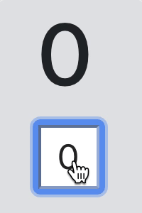

# LiveStore

Share reactive state across nested [LiveView](https://github.com/phoenixframework/phoenix_live_view)'s

## Installation

The package can be installed by adding `live_store` to your list of dependencies in `mix.exs`:

```elixir
def deps do
  [
    {:live_store, "~> 0.1.0"}
  ]
end
```

## Usage

Root LiveView

```elixir
defmodule MyAppWeb.CounterLive do
  use Phoenix.LiveView

  def render(assigns) do
    ~L"""
    <h1><%= @val %></h1>
    <%# render child template and pass the store pid with session %>
    <%= live_render @socket, UsersFlaskWeb.CounterButtonLive, session: %{store: @store} %>
    """
  end

  def mount(_session, socket) do
    # create a store in root component and subscribe for `:val` changes
    store =
      LiveStore.create(val: 0)
      |> LiveStore.subscribe([:val])

    socket =
      socket
      # store the pid of the store to assigns
      |> assign(store: store)
      # copy store `:val` to LiveView assigns
      |> assign(LiveStore.take(store, [:val]))

    {:ok, socket}
  end

  # handle all store changes by copying them to assigns
  def handle_info({:store_change, key, val}, socket) do
    {:noreply, assign(socket, key, val)}
  end
end
```

Child LiveView

```elixir
defmodule MyAppWeb.CounterButtonLive do
  use Phoenix.LiveView

  def render(assigns) do
    ~L"""
    <button phx-click="inc"><%= @val %></button>
    """
  end

  # retrieve the store pid from the session
  def mount(%{store: store}, socket) do
    if connected?(socket) do
      # subscribe for `:val` changes
      LiveStore.subscribe(store, [:val])
    end

    socket =
      socket
      # store the pid of the store to assigns
      |> assign(store: store)
      # copy store `:val` to LiveView assigns
      |> assign(LiveStore.take(store, [:val]))

    {:ok, socket}
  end

  # handle all store changes by copying them to assigns
  def handle_info({:store_change, key, val}, socket) do
    {:noreply, assign(socket, key, val)}
  end

  # update store instead of the assigns
  def handle_event("inc", _, socket = %{assigns: %{store: store}}) do
    LiveStore.update(store, :val, &(&1 + 1))
    {:noreply, socket}
  end
end
```


